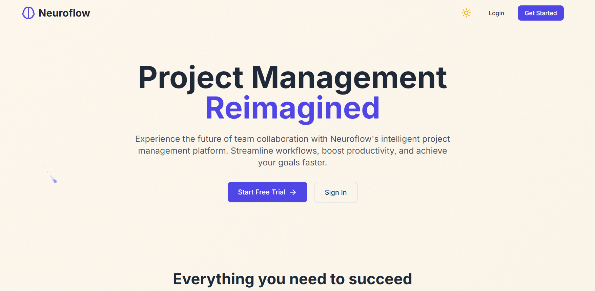
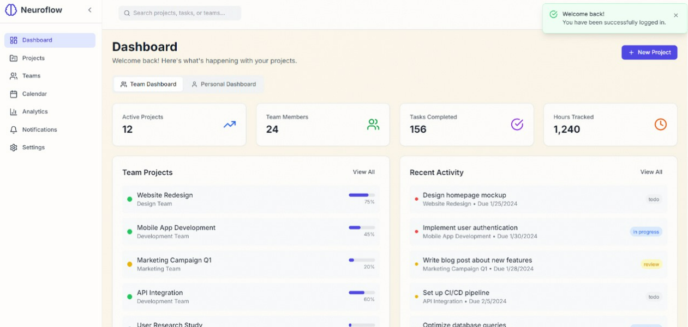
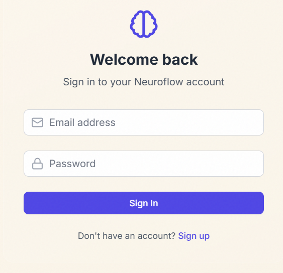
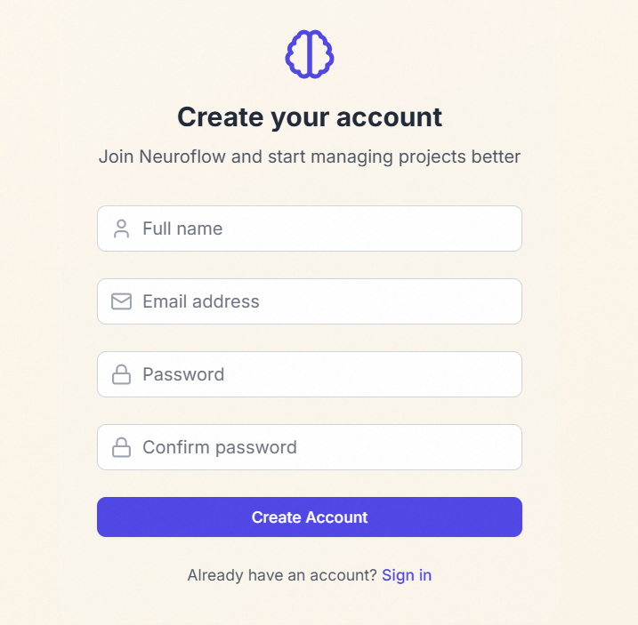
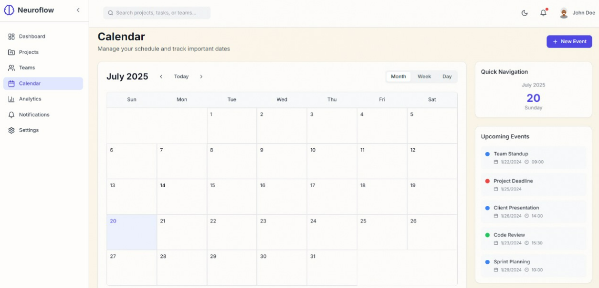
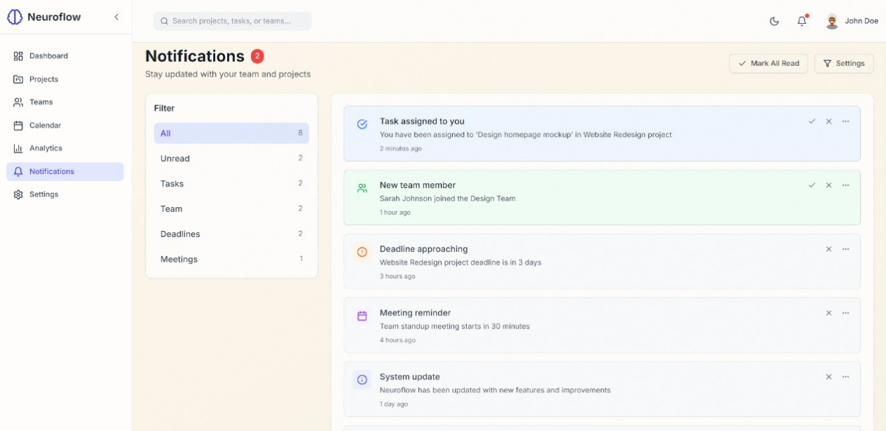

# NeuroFlow - Project Management Application

NeuroFlow is a comprehensive project management application built with the MERN stack (MongoDB, Express.js, React, Node.js). It provides features for managing projects, tasks, teams, calendar events, file uploads, and analytics.

## Live Demo

[Visit NeuroFlow](https://neurflow.vercel.app/)

## Features

- User authentication and authorization
- Project and task management
- Team collaboration
- Calendar and event scheduling
- File uploads and management
- Real-time notifications
- Analytics dashboard
- Responsive design

## Screenshots

### Home Page


### Dashboard


### Login Page


### Signup Page


### Calendar


### Notifications


## Setup Instructions

### Prerequisites

- Node.js (v14 or higher)
- pnpm package manager
- MongoDB Atlas account or local MongoDB installation

### Client Setup

1. Navigate to the client directory:
   ```bash
   cd client
   ```

2. Install dependencies:
   ```bash
   pnpm install
   ```

3. Create a `.env` file in the client directory with the following variables:
   ```
   VITE_API_URL=http://localhost:5000/api
   VITE_WS_URL=ws://localhost:8080
   ```

4. Start the development server:
   ```bash
   pnpm dev
   ```

5. The client will be available at `http://localhost:5173`

### Server Setup

1. Navigate to the server directory:
   ```bash
   cd server
   ```

2. Install dependencies:
   ```bash
   pnpm install
   ```

3. Create a `.env` file in the server directory with the following variables:
   ```
   PORT=5000
   MONGO_URI=your_mongodb_connection_string
   JWT_SECRET=your_jwt_secret
   JWT_EXPIRE=30d
   JWT_REFRESH_EXPIRE=90d
   NODE_ENV=development
   ```

4. Start the development server:
   ```bash
   pnpm dev
   ```

5. The server will be available at `http://localhost:5000`

## API Documentation

The server provides RESTful API endpoints for managing users, teams, projects, tasks, events, files, and analytics. For detailed API documentation, please refer to the [Server README](./server/README.md).

## Technologies Used

### Frontend
- React
- React Router
- Tailwind CSS
- Recharts (for analytics)
- React Beautiful DnD (for drag-and-drop)

### Backend
- Node.js
- Express.js
- MongoDB with Mongoose
- JWT Authentication
- Multer (for file uploads)

## License

This project is licensed under the MIT License - see the [LICENSE](./LICENSE) file for details.